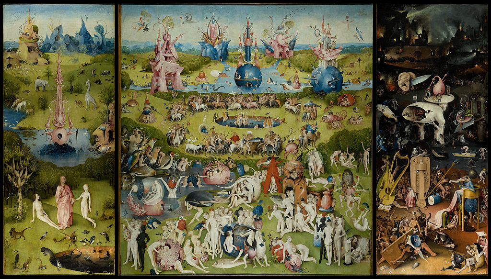
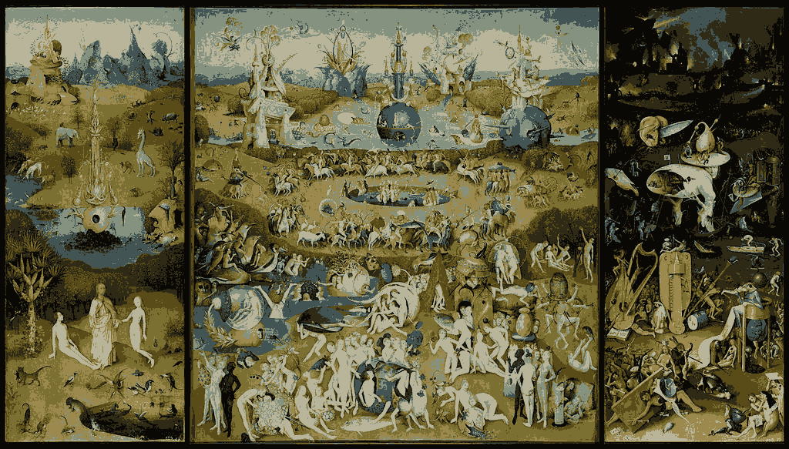
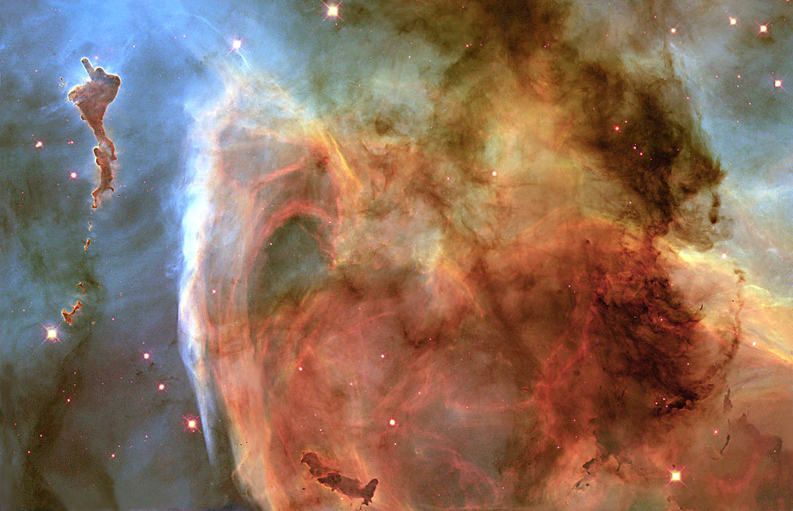
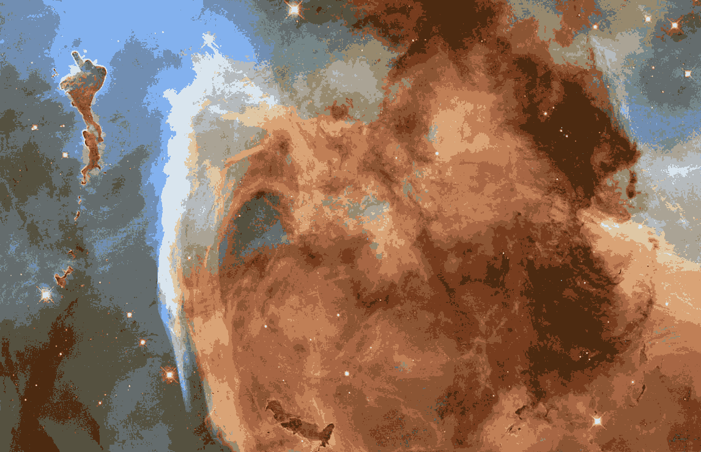
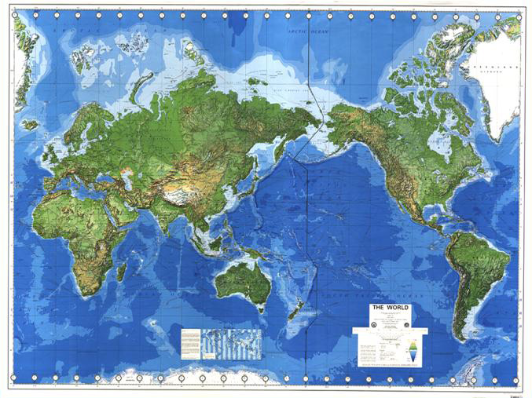
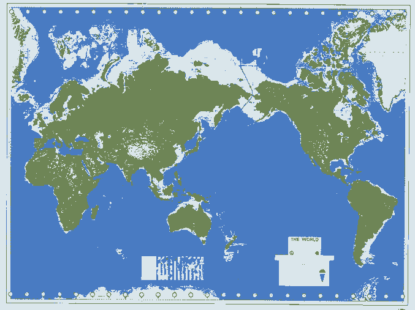

# ColorReducer

Reduce the number of colors in an image.

## About ColorReducer

ColorReducer can be used to lower the number of colors in an image, while preserving how the image looks. If you are interested, it uses the [k-means](https://en.wikipedia.org/wiki/K-means_clustering) algorithm. I wouldn't recommend this for actual compression, because there are much better techniques, but it does produce some interesting images.

It can also reduce the number of values in an audio file, which is like reducing it from 16-bit to 8-bit (etc.), but it does a better job of doing this than most converters, because it tries to match the original audio file (specifically, it will probably do a better job at reducing a very quiet audio file).

Additionally, you can use it to reduce the number of "values" in any data you have (see [Text and Raw Data](##Text and Raw Data)).

## Running ColorReducer

To run ColorReducer, just download one of the [releases](https://github.com/pommicket/ColorReducer/releases), and run the binary file.
You will need to run it from the command line to pass arguments to it. If you
want to reduce `input.png` to five colors, and output to `output.png`, just use this
command:

```bash
./ColorReducer input.png -k 5 output.png
```
Use `./ColorReducer --help` to see more command line options.

By default, ColorReducer will only use 10% of the data for k-means. If you are
using a small data set (text/raw data), you might want to change this. You can
do this with `--take=0.5` (this would make it use 50%).

## Images, audio, and video

ColorReducer will automatically determine whether you are inputting audio or
an image by checking the file extension (but you can force it with `--audio` or
`--image`). **Currently, only PNG and WAV files are supported.**

### Some examples

Original  


8 colors  


Original  


16 colors  


Original  


3 Colors  


You can find more examples, and links to the original images in the `examples`
directory. 

### Video

You can also
reduce video files, but this is done through the use of the python scripts
`video_to_raw.py` and `raw_to_video.py`. This feature is kind of
experimental, and will produce large files and use a lot of memory for long/high
quality videos. To convert a video, say `input.mp4` to a raw file, use

```bash
python video_to_raw.py input.mp4 input.raw
```

Make note of the final line of output of this program; you will need it to convert
the raw file back into a video.
This will produce a warning if the size of the raw file will exceed 1GB.
If the file is larger the amount of memory you
have, you shouldn't use it. Then, input the raw file into ColorReducer. Using:
```bash
./ColorReducer input.raw -k 5 output.raw --take=0.01
```
The `take` part isn't necessary, but it will make it run much faster. In fact,
you might want to make that `0.01` number even lower if it is running slowly.

Then, to convert it to a video, just use
```bash
python raw_to_video.py output.raw output.avi 1280 720 24
```
But replace `1280 720 24` with the numbers in the last line of output of `video_to_raw.py`.

### Video with audio

The method shown above won't reduce any audio contained in the video. To do this,
you will need to split the audio and video, reduce each, then combine them again.
This can be done with a tool like `ffmpeg`. E.g.

```bash
ffmpeg -i file.mp4 audio.wav
```

Then just run `file.mp4` through the process shown above, and reduce `audio.wav`
normally. Then, use

```bashbash
ffmpeg out.mp4 -i audio_output.wav -i video_output.avi
```

To re-combine them.

## Text and Raw Data

If you want to reduce your own file formats, you will need to create either a
raw or a text file.

### Text Data

Text data is in the following format
```
<number of pieces of data> <number of numbers in each piece of data>
<data[0][0]> <data[0][1]> <data[0][2]>...
<data[1][0]> <data[1][1]> <data[1][2]>...
<data[2][0]> <data[2][1]> <data[2][2]>...
...
```
For example, this file (`in.txt`):
```
5 2
0.3 0.2
1.1 2.2
7.4 3.6
2.2 8.9
-1.3 -3.8
```
will represent the five two-dimensional points (0.3, 0.2), (1.1, 2.2), (7.4, 3.6),
(2.2, 8.9), and (-1.3, -3.8).

You can input it with:

```bash
./ColorReducer in.txt -k 2 out.txt
```

The output file will be in the same format, but with different numbers.

### Raw Data

Raw data is in the same format as text data, but it uses raw 4-byte integers and
floating-point numbers instead of their base 10 representations, e.g. this file,
shown in hexadecimal notation:
```
03 00 00 00 02 00 00 00
ndata = 3   data_size=2
00 00 a0 40 00 00 40 40
5 as a float    3.0
00 00 c0 40 cd cc 0c 40
6.0         2.2
00 00 10 41 00 00 80 bf
9.0         -1.0
```
This is if you're using a little-endian system. You can input it with:
```bash
./ColorReducer in.raw -k 2 out.raw
```

The output file will be in the same format, but with different numbers.

Using raw data will (usually) make the file smaller. But if you don't need more than 1
decimal place of precision (or if you're using integers), and if you don't have
any negative numbers with one decimal place, a text file might actually be
smaller.

## Compiling

On GNU/Linux and probably OS X, you can compile ColorReducer with:
```bash
mkdir -p bin
cd bin
cmake ../src
make
```

You will need libpng to compile it which you can install with:
```bash
sudo apt install libpng-dev
```
On Ubuntu/Debian (`brew` probably has libpng too).
You can try to get this to work properly on Windows if you want.

### Compiling for Windows

You can compile ColorReducer for Windows on GNU/Linux using the
[MinGW source release](https://github.com/pommicket/ColorReducer/releases).
Just run `buildwin.sh` to compile it. A lot of the stuff there is from
[GnuWin32](http://gnuwin32.sourceforge.net/packages/libpng.htm).

## Voronoi diagrams

You can also make voronoi diagrams with ColorReducer. You will need to make an
image which is entirely white except for some seed pixels (see
`examples/voronoi_input.png`). To create a voronoi diagram from an image, just use
```bash
./ColorReducer --voronoi input.png output.png
```
